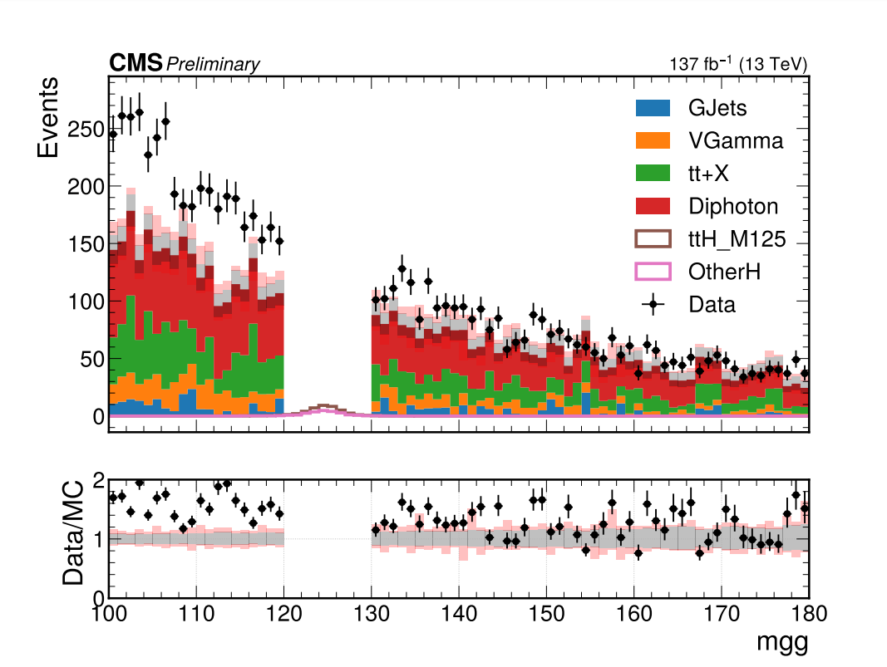
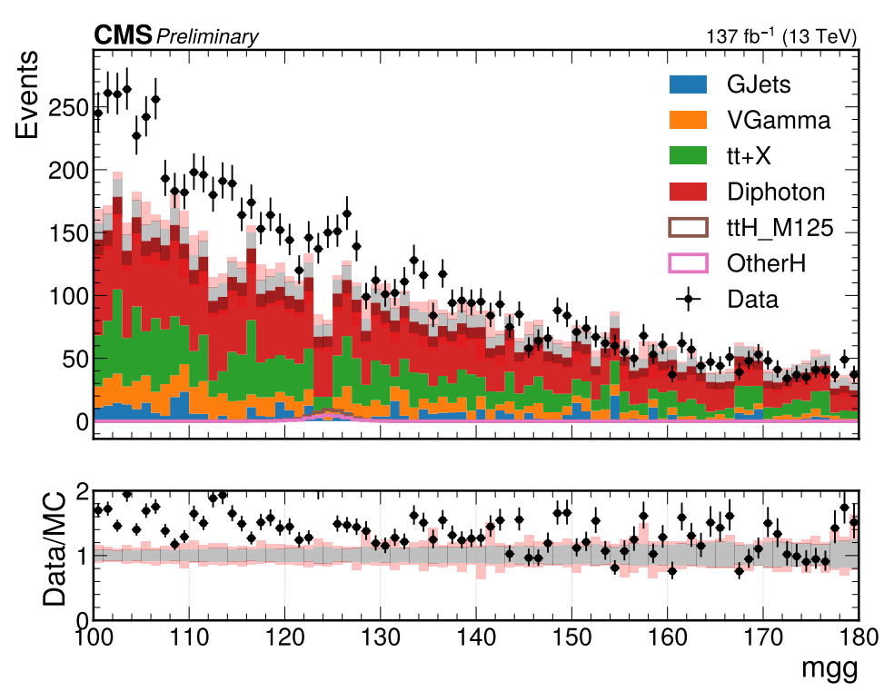
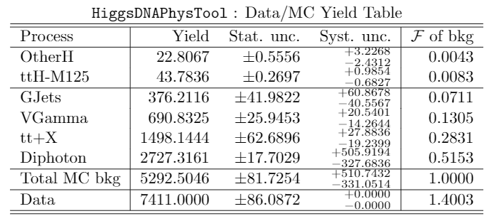
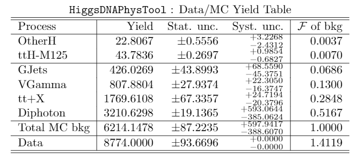

# HiggsDNA tutorial feedback

This feedback is based on changes to the `correctionlib_systematics` branch of [`https://gitlab.cern.ch/smay/HiggsDNA`](https://gitlab.cern.ch/smay/HiggsDNA) from around [3 February 2022](https://gitlab.cern.ch/smay/HiggsDNA/-/commit/3b56611f6f4f52580cd565b94e2c4d8226f6477d). 

## Retire / Unretire jobs 

Testing the `--retire_jobs` and `--unretire_jobs` options for `scripts/run_analysis.py`. First ran the command:

```
python scripts/run_analysis.py --log-level "DEBUG" --config "metadata/tutorial/tth_presel_withSyst_2018DataOnly.json" --merge_outputs --output_dir "tutorial_tth_withSyst_dataOnly" --batch_system "condor"
```

After allowings some jobs to begin running, ran the same command but with the `--retire_jobs` flag added. At first there are minutes of delay, and then the manager appears to run and states:

```
DEBUG    [AnalysisManager : __init__] Retiring all unfinished jobs.
```

Full log saved [here](https://www.google.com), `summary.json` file produced, so this appears to work properly.

- Thought: For me, `condor_q` does not show any jobs as `DONE`, only as `RUN` or `IDLE`. Is there a way to submit condor jobs such that the number of jobs `DONE` on a given node is displayed from `condor_q`? I think it would help for monitoring through condor - even if one can monitor the percentage of finished jobs through `run_analysis.py`. 

Then, after running the same above command but with the `--unretire_jobs` flag added, this appears to successfully work as 410 jobs are unretired, after 410 were retired from the previous step. Full log saved [here](), now see 410 idle jobs from `condor_q`, so they appear to actually be resubmitted.

- Question: Since merging was already done after `--retire_jobs` was used, do we need to worry about double counting files when merging is done again after `--untretire_jobs`? Additionally, will the `summary.json` file be properly updated? 

## Blind option 

The blind option appears to work. Ran the following two commands:

```
python bonus/assess.py --input_dir "tutorial_tth_withSyst" --make_tables --group_procs "OtherH:ggH_M125,VBFH_M125,VH_M125|GJets:GJets_HT-600ToInf,GJets_HT-400To600,GJets_HT-200To400,GJets_HT-100To200,GJets_HT-40To100|VGamma:ZGamma,WGamma|tt+X:TTGG,TTGamma,TTJets" --signals "ttH_M125,OtherH" --output_dir ttH_noBlind  --plots Variables.json
python bonus/assess.py --input_dir "tutorial_tth_withSyst" --make_tables --group_procs "OtherH:ggH_M125,VBFH_M125,VH_M125|GJets:GJets_HT-600ToInf,GJets_HT-400To600,GJets_HT-200To400,GJets_HT-100To200,GJets_HT-40To100|VGamma:ZGamma,WGamma|tt+X:TTGG,TTGamma,TTJets" --signals "ttH_M125,OtherH" --output_dir ttH_Blind --blind  --plots Variables.json
```

And obtained the following two diphoton mass distributions clearly showing the blinding working as expected:

Blinded             |  Unblinded
:-------------------------:|:-------------------------:
  |  

And obtained the following two yields tables, where the unblinded table contains more stats for bkg MC and data as expected:

Blinded             |  Unblinded
:-------------------------:|:-------------------------:
  |  
